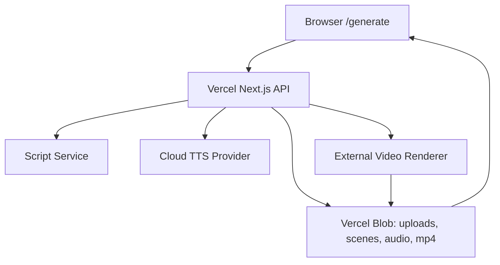

# ReviewReel Vercel 部署计划

更新时间：2026-04-24

## 1. 结论

ReviewReel 可以部署到 Vercel，但生产架构需要拆成两层：

- Vercel：承载 Next.js 前端、API 编排、Job 状态、上传入口、下载链接。
- 外部媒体服务：承载 FFmpeg 合成、真实 TTS、持久化媒体文件处理。

当前本地 MVP 不能原样直接上 Vercel 作为完整视频生成服务，原因是：

- Vercel Functions 文件系统只读，只能写 `/tmp` 临时空间，不能写 `public/generated` 作为持久输出。
- 当前海报渲染依赖 macOS `qlmanage`，Vercel Linux runtime 不支持。
- 当前中文 TTS 依赖 macOS `say`，Vercel Linux runtime 不支持。
- 上传和生成的视频需要持久 URL，不能依赖函数实例本地磁盘。

## 2. 目标架构



## 3. Vercel 负责什么

- 页面：`/generate`
- API 编排：`/api/generate`
- Job 查询：`/api/jobs/:id`
- 上传入口：先接入 Vercel Blob，后续可换 S3/R2。
- 状态存储：短期内存仅用于本地；生产建议 Vercel KV、Postgres 或 Upstash Redis。
- 媒体 URL：返回 Blob public URL 或受控下载 URL。

## 4. 不放在 Vercel Function 里的部分

- 长时间 FFmpeg 合成。
- 依赖系统二进制的海报渲染。
- macOS-only TTS。
- 大文件持久存储。

可选媒体 worker：
- Cloud Run / Fly.io / Render / Railway：适合 Docker + FFmpeg。
- AWS Lambda container：适合短视频合成，但要控制包体和临时盘。
- Modal / Replicate / dedicated media API：适合后续 AI 图片、TTS、视频生成。

## 5. 分阶段迁移

### Phase 6.1：部署护栏（已开始）

已完成：
- 新增 `vercel.json`，为重型 API route 配置更长 `maxDuration` 和内存。
- 新增 `.gitignore`，避免 `.next`、`node_modules`、`public/generated`、本地 env 文件进入仓库。
- 新增 `.env.example`，标明本地和生产环境变量。

待完成：
- 增加 production runtime guard：在 Vercel 环境中如果没有配置远程 renderer，返回明确错误，不再尝试 `qlmanage` / `say`。
- 把 `public/generated` 迁移为 storage provider 接口。

### Phase 6.2：Storage Provider

目标：
- 本地继续使用 `public/generated`。
- Vercel 使用 Blob。

步骤：
1. 新增 `lib/storage.ts`。
2. 定义 `saveGeneratedAsset(buffer, contentType, name)`。
3. 本地 provider 写 `public/generated`。
4. Blob provider 写 Vercel Blob。
5. 上传 API 改为返回 Blob URL 或本地 URL。
6. 视频输出统一返回可公开访问 URL。

验收：
- 本地生成流程不变。
- Vercel 环境不写 `public/generated`。
- 上传图片、音频、视频都有持久 URL。

### Phase 6.3：云端 TTS

目标：
- 本地可继续使用 `system:Tingting`。
- Vercel 使用云端 TTS。

步骤：
1. 抽象 `cloud` provider。
2. 支持中文普通话语音。
3. 失败时 fallback 到静音音轨或无音频视频。
4. `voiceProvider` 记录真实 provider。

验收：
- Vercel 上中文“拉州拉面馆”能生成真实语音。
- 没有 TTS key 时能给出明确配置错误或降级结果。

当前状态：部分完成。

已实现：
- `TTS_PROVIDER=cloud` 或 `TTS_PROVIDER=remote` 会调用 `TTS_ENDPOINT_URL`。
- Vercel 环境未显式设置 provider 时默认使用 `cloud`，避免调用 macOS `say`。
- 请求头使用 `Authorization: Bearer ${TTS_API_KEY}`。
- endpoint 可以返回：
  - `{ "audioUrl": "https://..." }`
  - `{ "audioBase64": "...", "contentType": "audio/mpeg" }`
- `audioBase64` 会通过 storage provider 保存，本地写入 `public/generated`，生产可写入 Blob。

### Phase 6.4：远程视频渲染服务

目标：
- Vercel `/api/generate` 只做编排。
- 视频合成由 `VIDEO_RENDERER_URL` 指向的 worker 完成。

接口建议：

```json
{
  "templateId": "bold-food",
  "script": {
    "hook": "拉州拉面馆，汤头香别错过",
    "socialProof": ["..."],
    "cta": "今天就去拉州拉面馆吃一碗。"
  },
  "imageUrls": ["https://..."],
  "audioUrl": "https://...",
  "subtitles": ["...", "...", "..."]
}
```

返回：

```json
{
  "videoUrl": "https://..."
}
```

验收：
- Vercel API 能在 30 秒内完成一次编排请求。
- 渲染 worker 生成 1080x1920 MP4。
- 输出视频存入 Blob 或 renderer 自己的对象存储。

当前状态：部分完成。

已实现：
- `lib/video-renderer.ts` 定义 renderer adapter。
- 未配置 `VIDEO_RENDERER_URL` 时，本地继续使用 FFmpeg。
- 已配置 `VIDEO_RENDERER_URL` 和 `VIDEO_RENDERER_TOKEN` 时，请求远程 renderer。
- `/api/generate` 远程模式会跳过本地 `createSceneImages`，不再依赖 `qlmanage`。
- `/api/generate-video` 可单独使用远程 renderer。

远程 renderer 请求体：

```json
{
  "businessName": "拉州拉面馆",
  "reviews": ["牛肉面汤头很香，分量特别足"],
  "script": {
    "hook": "拉州拉面馆，汤头香别错过",
    "socialProof": ["食客都夸：牛肉面汤头很香，分量特别足"],
    "cta": "今天就去拉州拉面馆吃一碗。"
  },
  "imageUrls": ["https://..."],
  "audioUrl": "https://...",
  "subtitles": ["...", "...", "..."],
  "templateId": "bold-food",
  "output": {
    "width": 1080,
    "height": 1920,
    "durationSeconds": 15,
    "format": "mp4"
  }
}
```

远程 renderer 响应体：

```json
{
  "videoUrl": "https://...",
  "images": ["https://..."],
  "provider": "cloud-run:ffmpeg"
}
```

## 6. Vercel 环境变量

必需：
- `BLOB_READ_WRITE_TOKEN`（Vercel Blob Store 创建后自动注入）
- `VIDEO_RENDERER_URL`（renderer 服务地址，如 `https://reviewreel-renderer.up.railway.app`）
- `VIDEO_RENDERER_TOKEN`（renderer 认证 token）

TTS 不再需要单独配置：renderer 内置了 Edge TTS（免费），会自动处理语音生成。

本地可选：
- `TTS_PROVIDER=system`（macOS `say`）
- `FFMPEG_PATH=ffmpeg`

## 7. 部署前检查清单

- [x] `npm run lint`
- [x] `npm run typecheck`
- [x] `npm run build`
- [x] `public/generated` 没有被纳入 git
- [x] Vercel 项目已配置 Blob
- [ ] Vercel 环境变量已配置（VIDEO_RENDERER_URL + VIDEO_RENDERER_TOKEN）
- [x] 生产环境不调用 `qlmanage`
- [x] 生产环境不调用 macOS `say`
- [ ] 生产视频输出为 renderer 返回的 media URL
